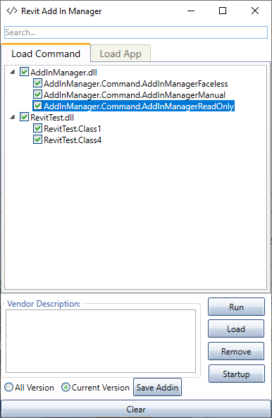
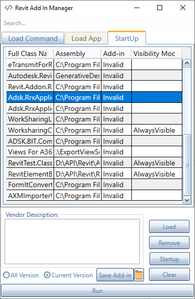

# Revit Add-in Manager

## WORK IN PROCESS

## Summary

The Plugin support developer improve developer to increase job performance with some feature. Frequent need to open and close **assemblers** is very difficult for .NET Framework , recent improvement with .NET Core has some improved API to make it easier. So this project helps make these jobs easier through copy-and-reload tricks can use for .NET Framework and .NET Core in feature.

In addition, I open a project to attract talents from all over the world to support development, I'm a person, who loves open source very much and writes code every day as a pleasure.

Some feature include: 
- Add-in tester
- Add-in manager
    - AddInManagerFaceless
    - AddInManagerManual
    - AddInManagerReadOnly
- Startup manager
- Quick create `.addin` and load to `Revit`
- Clear Cache saved in temp folder
- Quick remove an Add-in not used in working process

## Add-In Manager

### Command

- [x] AddInManagerManual
- [x] AddInManagerFaceless
- [x] AddInManagerReadOnly
- [ ] Application
### Startup

- [x] Show info all add-in installed in computer include all Add-in from Autodesk
- [x] Enable or Disable Add-in with right click

## Installation

TODO

## Author

Originally implemented by Autodesk with platform Windows Forms And now it Maintain by [ChuongHo](https://github.com/chuongmep) with platform WPF and add more feature to fit with the progressive development of modern technology. His focus is to work smarter and achieve the most effective practices to enhance data utilization and digital collaboration among AEC parties.

## License

This sample is licensed under the terms of the [MIT License](http://opensource.org/licenses/MIT). Please see the [License](License.md) file for full details.

Credit to [icons8.com](https://icons8.com) for the Revit Add-in Manager icons.

© 2010 Autodesk, Inc.  All rights reserved. All use of this Software is subject to the terms and conditions of the Autodesk End User License Agreement accepted upon installation of this Software and/or packaged with the Software.

## Third-Party Software Credits and Attributions

[SplitButton](SplitButton_License(BSD).txt) Copyright (c) 2010, wyDay. All rights reserved.

## Trademarks

Autodesk and Revit  are registered trademarks or trademarks of Autodesk, Inc., and/or its subsidiaries and/or affiliates, in the USA and/or other countries. 

All other brand names, product names or trademarks belong to their respective holders.

## Contribute

**Add-In Manager** is an open-source project and would be nothing without its community. You can make suggestions or track and submit bugs via Github [issues](https://docs.github.com/en/issues/tracking-your-work-with-issues/creating-an-issue). You can submit your own code to the **Add-In Manager** project via a Github [pull request](https://docs.github.com/en/pull-requests/collaborating-with-pull-requests/proposing-changes-to-your-work-with-pull-requests/about-pull-requests).

## Sponsors

Thanks to [JetBrains](https://www.jetbrains.com/) for providing licenses for [Rider](https://www.jetbrains.com/rider/) and [dotUltimate](https://www.jetbrains.com/dotnet/) tools, which both make open-source development a real pleasure!