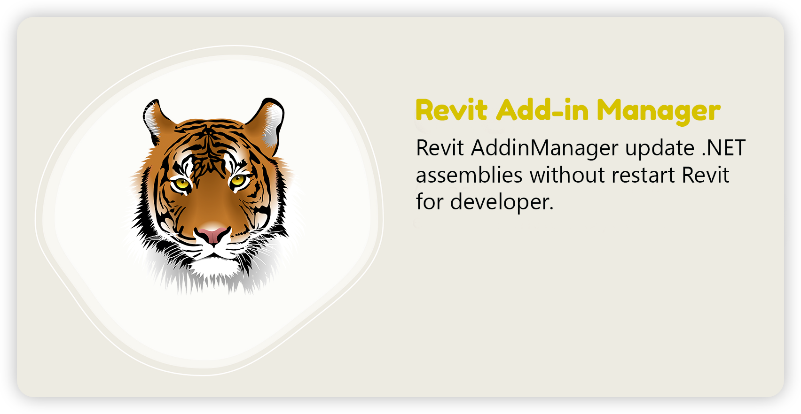
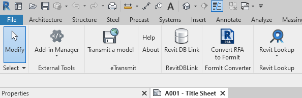
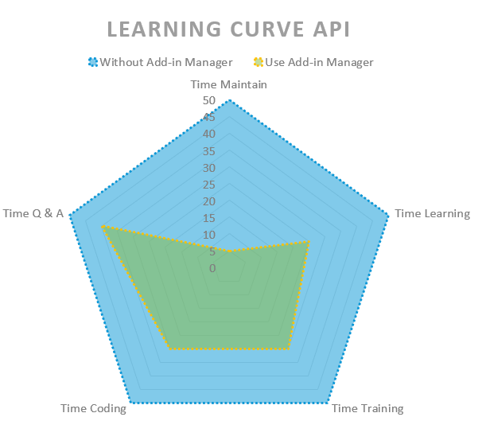
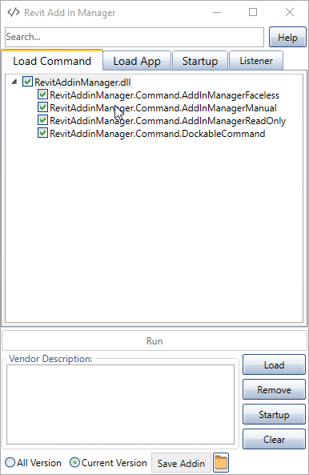
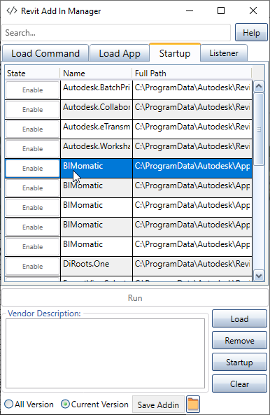
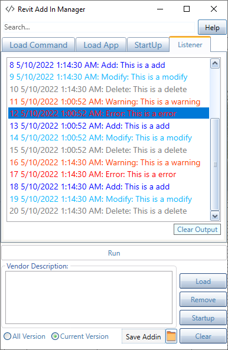

# Revit Add-in Manager
  [](https://opensource.org/licenses/MIT)

   

[](../../actions)
[]()
[](http://hits.dwyl.com/chuongmep/revitaddinmanager)
<a href="https://twitter.com/intent/follow?screen_name=chuongmep">
</a>



## 💖 Support This Project

If you like this project and want to support its development, please consider making a donation. Your contributions will help us continue to improve and maintain the project.

<p align="center">
  <a href="https://donate.stripe.com/8wM4i89xI6s74Uw003">
    
  </a>
</p>


## 📋 Summary



Usually, when developing and debugging an addin with RevitAPI, user has to close & re-open Revit each time he/she modifies the addin code and wants to re-compile. But with Add-In Manager, user can modify and run the addin directly without closing & re-opening Revit again and again. With current technology, you can use Hot Reload to speed it up.But try this project it will be faster with any Addin.


The product will be expanded in the future in process to support mutiple platform : 

- [x] [Revit Add-In Manager](https://github.com/chuongmep/RevitAddInManager)

- [x] [Navis Add-In Manager](https://github.com/chuongmep/NavisAddInManager)

- [x] [Cad Add-In Manager](https://github.com/chuongmep/CadAddInManager)

- [x] More...


### 📦 Some feature include:

- Add-in tester(use Debug and Trace to test your add-in)
- Add-in manager
    - AddInManagerFaceless
    - AddInManagerManual
    - AddInManagerReadOnly
    - Application
- Startup manager
- Bip Checker - Check Built-in Parameter of the Element
- Bip Compare - Compare Built-in Parameter of two Element
- **Debug / Trace** : Support Show result use [Debug](https://docs.microsoft.com/en-us/dotnet/api/system.diagnostics.debug?view=net-6.0) or [Trace](https://docs.microsoft.com/en-us/dotnet/api/system.diagnostics.trace?view=net-6.0) to show result in Revit
- Quick create `.addin` and load to `Revit`
- Clear Cache saved in temp folder
- Quick remove an Add-in not used in working process
- No depend on any library from outside **RevitAPI**.
- A newbie can create new Add-in in a few minutes and easily explore Revit API.



- <kbd>F5</kbd> - Load fresh plugin don't need load again.
- <kbd>F1</kbd> - Go link open source report some error,bug or feature request.
- <kbd>Delete</kbd> - Quick remove by use right click or use from keyboard.
- <kbd>Crt + MouseWheel</kbd> - Zoom in/out by use mouse wheel in command plugin.
- <kbd>Arrow Up</kbd> - Move from TreeView to search.
- <kbd>Arrow Down</kbd> - Move from search to TreeView.
- <kbd>Esc</kbd> - Quick Close Add-in Manager.
- <kbd>Enter</kbd> - Quick Run Execute a command selected in Add-in Manager.
- <kbd>Alt + T</kbd> - Change theme Default, Dark, Light.
## 📭 Add-In Manager



### Command

- [x] AddInManagerManual
- [x] AddInManagerFaceless
- [x] AddInManagerReadOnly
- [x] Bip Checker
- [x] Bip Compare
### Application

- [x] Preview
- [x] Save And Load Application .Addin

### Startup

- [x] Show info all add-in installed in computer include all Add-in from Autodesk.
- [x] Enable or Disable Add-in.



### Trace/Debug

- [x] Show/Hide result inside **Dockpanel Revit**.
- [x] Show Result history inside **Revit Addin Manager**.
- [x] Clear Result.
- [X] Show Result by color.




---

## ⚙️ Installation

Please follow last release at section [Release](https://github.com/chuongmep/RevitAddInManager/releases/latest)

### Version support : From Revit 2019 to Revit 2026.

---

## ⌨️Guideline

- Quick Example to Execute a Command : 
``` cs
using Autodesk.Revit.Attributes;
using Autodesk.Revit.DB;
using Autodesk.Revit.UI;
using Autodesk.Revit.UI.Selection;
[Transaction(TransactionMode.Manual)]
public class TestCommand : IExternalCommand
{
    public Result Execute(ExternalCommandData commandData, ref string message, ElementSet elements)
    {
        //Code Something 
        return Result.Succeeded;
    }
}
```
- Quick Example to **Debug** or **Trace** result output :

```cs
using Autodesk.Revit.Attributes;
using Autodesk.Revit.DB;
using Autodesk.Revit.UI;
using Autodesk.Revit.UI.Selection;
[Transaction(TransactionMode.Manual)]
public class TraceWriteLine : IExternalCommand
{
    public Result Execute(ExternalCommandData commandData, ref string message, ElementSet elements)
    {
        //Trace or Debug Something
        Debug.Write($"Message output");
        Debug.WriteLine($"Message output");
        Trace.Write($"Message output");
        Trace.WriteLine($"Message output");
        return Result.Succeeded;
    }
}
```
You can visit to wiki and read document or access by this [link](https://github.com/chuongmep/RevitAddInManager/wiki).

Some topic common:
- [How to install Add In Manager](https://github.com/chuongmep/RevitAddInManager/wiki/How-to-install-AddinManager)
- [How to Uninstall Add In Manager](https://github.com/chuongmep/RevitAddInManager/wiki/How-to-Uninstall-AddinManager)
- [How To Use Add In Manager](https://github.com/chuongmep/RevitAddInManager/wiki/How-To-Use-Add-In-Manager)
- [How To Use Bip Checker](https://github.com/chuongmep/RevitElementBipChecker)
- [How To Use Compare Parameter Element](https://github.com/chuongmep/RevitAddInManager/wiki/How-to-use-Compare-Parameter-Element)
- [Fix Problem With Installer AddinManager](https://github.com/chuongmep/RevitAddInManager/wiki/Fix-Problem-With-Installer-AddinManager)
- [How To Use Debug Trace Show Output](https://github.com/chuongmep/RevitAddInManager/wiki/How-To-Use-Debug-Trace-Show-Output)

---

### 🧺 Practical Example

Please visit to [Example](./Test/Sample) to keep learning and explore more about Revit API.

## ✒️ Author

Originally implemented by Autodesk with platform **Windows Forms** and now it maintain by [ChuongHo](https://github.com/chuongmep) with platform **WPF** and add more feature to fit with the progressive development of modern technology. His focus is to work smarter and achieve the most effective practices to enhance data utilization and digital collaboration among AEC parties.

---

## 📄 License

This sample is licensed under the terms of the [MIT License](http://opensource.org/licenses/MIT). Please see the [License](License.md) file for full details.

Credit to [icons8.com](https://icons8.com) for the Revit Add-in Manager icons.

© 2010 Autodesk, Inc.  All rights reserved. All use of this Software is subject to the terms and conditions of the Autodesk End User License Agreement accepted upon installation of this Software and/or packaged with the Software.

---

## 🍚 Contribute

**Add-In Manager** is an open-source project and would be nothing without its community. You can make suggestions or track and submit bugs via Github [issues](https://docs.github.com/en/issues/tracking-your-work-with-issues/creating-an-issue). You can submit your own code to the **Add-In Manager** project via a Github [pull request](https://docs.github.com/en/pull-requests/collaborating-with-pull-requests/proposing-changes-to-your-work-with-pull-requests/about-pull-requests).

Many Thanks all contributors for this repository. Feel free to contribute!
Please refer to the [CONTRIBUTING](CONTRIBUTING.md) for details.

Many Thanks : 
- [Roman](https://github.com/Nice3point)
- [Ricaun](https://github.com/ricaun)
- [Hy Lam](https://github.com/sapiens-code)


<a href = "https://github.com/chuongmep/RevitAddInManager/graphs/contributors">
  
</a>

---

## 🎁 Sponsors


Thanks for providing a free All product IDE for this project.

---

## 🖇️ Learning Resources

- [Revit Developer Center](https://www.autodesk.com/developer-network/platform-technologies/revit)
- [Revit SDK Sample](https://github.com/jeremytammik/RevitSdkSamples)
- [Revit API Docs](https://www.revitapidocs.com/)
- [The Building Coder](https://thebuildingcoder.typepad.com/)

## 📌 Open Resource Recommend

I suggest you some of these projects, hope you will like it.

- [RevitLookup](https://github.com/jeremytammik/RevitLookup)

- [RevitLookupWpf](https://github.com/weianweigan/RevitLookupWpf)

- [RevitDBExplorer](https://github.com/NeVeSpl/RevitDBExplorer)

- [bim-net-interactive](https://github.com/jowsy/bim-net-interactive)

- [Revit.ScriptCS](https://github.com/sridharbaldava/Revit.ScriptCS)

- [Revit.TestRunner](https://github.com/geberit/Revit.TestRunner)

- [Revit.Async](https://github.com/KennanChan/Revit.Async)

- [pyRevit](https://github.com/eirannejad/pyRevit)

- [Bowerbird](https://github.com/ara3d/bowerbird)

[](https://star-history.com/#chuongmep/RevitAddInManager&Date)
