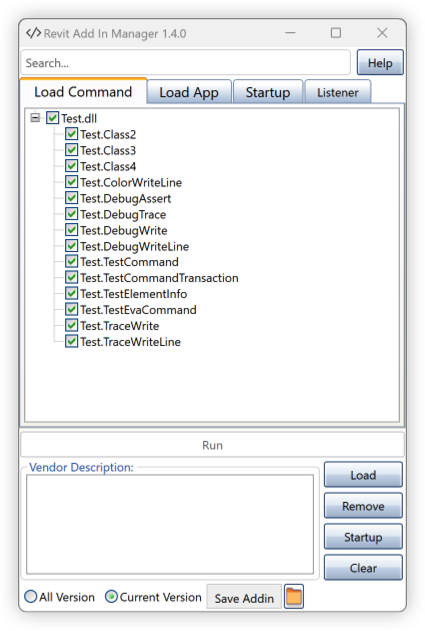

# Revit Add-in Manager

## WORK IN PROCESS

- [ ] Console
- [ ] Add-in Extend for **Autocad** And **Naviswork**

## Summary
Usually, when developing and debugging an addin with RevitAPI, user has to close & re-open Revit each time he/she modifies the addin code and wants to re-compile. But with Add-In Manager, user can modify and run the addin directly without closing & re-opening Revit again and again.

In addition, I open a project to attract talents from all over the world to support development, I'm a person, who loves open source very much and writes code every day as a pleasure.

Some feature include: 
- Add-in tester
- Add-in manager
    - AddInManagerFaceless
    - AddInManagerManual
    - AddInManagerReadOnly
- Startup manager
- Quick create `.addin` and load to `Revit`
- Clear Cache saved in temp folder
- Quick remove an Add-in not used in working process

## Add-In Manager

### Command

- [x] AddInManagerManual
- [x] AddInManagerFaceless
- [x] AddInManagerReadOnly
- [x] Application

### Startup

- [x] Show info all add-in installed in computer include all Add-in from Autodesk
- [x] Enable or Disable Add-in with right click

---

## Installation

Please follow last release at section [Release](https://github.com/chuongmep/RevitAddInManager/releases/latest)

---
## Build

Debugging:

- Run **Debug Profile** in Visual Studio or **Run Configuration** in JetBrains Rider. The required files have been added. All project files will be automatically copied to the
  Revit plugins folder.

Creating a package:

- Open the terminal of your IDE.
- Install Nuke global tools `dotnet tool install Nuke.GlobalTool --global`.
- Run `nuke` command.
- The generated package will be in the **output** folder.

For more information on building, see the [**RevitTemplates**](https://github.com/Nice3point/RevitTemplates) Wiki page.

**Note:** The project currently supports the version Revit from **2014** to **2023**.

Please refer to the [CHANGELOG](CHANGELOG.md) for details.

---

## Guideline

You can visit to wiki and read document or access by this [link](https://github.com/chuongmep/RevitAddInManager/wiki).

Some topic common:
- [How to install Add In Manager](https://github.com/chuongmep/RevitAddInManager/wiki/How-to-install-AddinManager)
- [How to Uninstall Add In Manager](https://github.com/chuongmep/RevitAddInManager/wiki/How-to-Uninstall-AddinManager)
- [How To Use Add In Manager](https://github.com/chuongmep/RevitAddInManager/wiki/How-To-Use-Add-In-Manager)
- [Fix Problem With Installer AddinManager](https://github.com/chuongmep/RevitAddInManager/wiki/Fix-Problem-With-Installer-AddinManager)

---

## Author

Originally implemented by Autodesk with platform **Windows Forms** and now it maintain by [ChuongHo](https://github.com/chuongmep) with platform **WPF** and add more feature to fit with the progressive development of modern technology. His focus is to work smarter and achieve the most effective practices to enhance data utilization and digital collaboration among AEC parties.

---

## License

This sample is licensed under the terms of the [MIT License](http://opensource.org/licenses/MIT). Please see the [License](License.md) file for full details.

Credit to [icons8.com](https://icons8.com) for the Revit Add-in Manager icons.

© 2010 Autodesk, Inc.  All rights reserved. All use of this Software is subject to the terms and conditions of the Autodesk End User License Agreement accepted upon installation of this Software and/or packaged with the Software.

---

## Trademarks

Autodesk and Revit  are registered trademarks or trademarks of Autodesk, Inc., and/or its subsidiaries and/or affiliates, in the USA and/or other countries. 

All other brand names, product names or trademarks belong to their respective holders.

---

## Contribute

**Add-In Manager** is an open-source project and would be nothing without its community. You can make suggestions or track and submit bugs via Github [issues](https://docs.github.com/en/issues/tracking-your-work-with-issues/creating-an-issue). You can submit your own code to the **Add-In Manager** project via a Github [pull request](https://docs.github.com/en/pull-requests/collaborating-with-pull-requests/proposing-changes-to-your-work-with-pull-requests/about-pull-requests).

Many Thanks all contributors for this repository. Feel free to contribute!

---

## Sponsors

Thanks to [JetBrains](https://www.jetbrains.com/) for providing licenses for [Rider](https://www.jetbrains.com/rider/) and [dotUltimate](https://www.jetbrains.com/dotnet/) tools, which both make open-source development a real pleasure!

---

## Open Resource Recommend

I suggest you some of these projects, hope you will like it.

- [RevitLookup](https://github.com/jeremytammik/RevitLookup)

- [RevitLookupWpf](https://github.com/chuongmep/RevitLookupWpf)

- [Revit.ScriptCS](https://github.com/sridharbaldava/Revit.ScriptCS)

- [Revit.TestRunner](https://github.com/geberit/Revit.TestRunner)

- [Revit.Async](https://github.com/KennanChan/Revit.Async)

- [pyRevit](https://github.com/eirannejad/pyRevit)